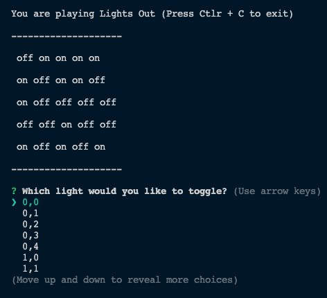

# SE_01 Software Development Basics Assessment (code dojo)

This repository holds the code implemented during the assessments of the module SE_01 Software Development Basics at CODE University of Applied Sciences during the Spring Semester 2022.



## The Challenge

Write a piece of software which allows you to play the logic puzzle Lights Out.

The game is played on  a 3x3 grid.
Each cell in the grid represents a  Light, that can be either on or off.
The game starts with some or all lights turned on.
The player's task is to switch off all lights.
This would be easy, if each light can be turned off individually - however - each time you toggle a light all its neighbors will be toggled as well.

If you're interested in playing around with the real game, there's an online sample of it available at [Dean Attali's website](https://daattali.com/shiny/lightsout/).

## Exercise 1: Lights Out 
 
### Instructions 
 
Write a program that lets you play this game. 

- Start by representing the game board. 
- Repeatedly ask the player which light they want to toggle. 
- Toggle the light and all direct(i.e. not the diagonal ones) neighbors. 
- Check if the game is won. 

## Exercise 2: More Light

### Instructions

Extend the board to also allow a 5x5 grid. The rest of the game play stays the same.


## Exercise 3: Let there be color

### Instructions

Instead of lights being only on and off, they can now shine in either Red, Green or Blue.
When the Player toggles them they cycle through Red -> Green -> Blue -> Off.
The rest of the game stays the same.

## Exercise 4: Random Boards`

### Instructions

Starting out with the same game all the time is hardly fun, so change the game setup in a way that
presents a different board every time.
Use the 5x5 board without colors for this exercise.

**Attention:** not all boards are solvable, but you want  your game to be.
There is an easy and a hard way to do this.
The hard way  is to randomly turn on some lights and  then check if the board is solvable. This is
hard because you need to write an algorithm to solve the game.
The easy way  is to start with an empty board, and  then do a random number of moves like the
player would.

### Hints:
Random Integers can be generated like this (example creates a random number between 0 and 5 inclusive):

[Example in Python](https://docs.python.org/3.10/library/random.html)
```python
import random

a_random_integer = random.randint(0, 5)
```

[Example in JavaScript](https://developer.mozilla.org/en-US/docs/Web/JavaScript/Reference/Global_Objects/Math/random)
```js
function getRandomIntInclusive(min, max) {
    min = Math.ceil(min);
    max = Math.floor(max);
    return Math.floor(Math.random() * (max - min + 1) + min);
}

let aRandomInteger = getRandomInt(0, 5);
```

## Details and FAQ:

- You do not need a graphical user interface for this exercises (any other form of interaction, for instance, through the command line interface, is acceptable as well)
- When the game is won, it should notify the player and end the game.
- You can use “all lights turned on” as the initial board.
